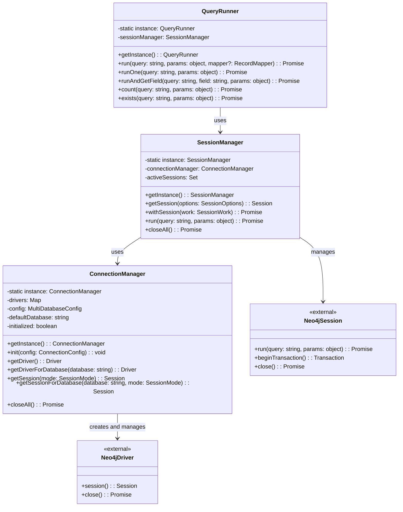

# Data Access Layer: The First Brick of NeoGM

This document provides a high-level overview of the Data Access Layer implementation, which forms the foundation of our Neo4j Object Graph Mapping (OGM) library.

## Architecture Overview

The Data Access Layer is the lowest level of our layered architecture, responsible for direct communication with the Neo4j database. It follows a singleton pattern with three main components:

1. **ConnectionManager**: Manages Neo4j driver instances and connection configuration
2. **SessionManager**: Handles Neo4j session lifecycle and provides utilities for session management
3. **QueryRunner**: Executes Cypher queries and transforms results into usable data

## Current Limitations

**Single Database Instance Support**:
- The current implementation is designed around a singleton pattern for the connection, session, and query management
- Only one Neo4j instance configuration can be active at a time
- While the code has provisions for multiple database names within a single Neo4j instance, true multi-instance support would require additional work

## Component Relationships

The implementation follows a hierarchical pattern:
- ConnectionManager creates and manages Neo4j driver instances
- SessionManager uses ConnectionManager to obtain and manage sessions
- QueryRunner uses SessionManager to execute queries



## Implementation Details

### ConnectionManager

The ConnectionManager is responsible for:
- Creating and managing Neo4j driver instances
- Storing and applying connection configuration
- Providing sessions for database operations
- Closing connections when they're no longer needed

It follows a singleton pattern, ensuring only one instance exists throughout the application lifecycle.

### SessionManager

The SessionManager handles:
- Obtaining sessions from the ConnectionManager
- Tracking active sessions to prevent leaks
- Providing utilities for executing work within a session
- Automatically closing sessions when operations complete

This component simplifies session management and helps prevent resource leaks.

### QueryRunner

The QueryRunner is responsible for:
- Executing Cypher queries through sessions
- Transforming Neo4j records into domain objects
- Providing convenience methods for common query patterns
- Handling query parameters securely

This abstraction makes it easier to execute queries without dealing directly with sessions.

## Data Flow

1. **Configuration**: The application initializes the ConnectionManager with Neo4j connection details
2. **Session Creation**: When a query needs to be executed, a session is obtained from the SessionManager
3. **Query Execution**: The QueryRunner executes Cypher queries through the session
4. **Result Transformation**: Results are transformed from Neo4j records to domain objects
5. **Resource Cleanup**: Sessions are automatically closed when operations complete

## Primary Use Patterns

### Direct Query Execution
```typescript
const results = await runQuery('MATCH (n:Person) RETURN n LIMIT 10');
```

### Transaction Management
```typescript
await sessionManager.withSession(async (session) => {
  const tx = session.beginTransaction();
  try {
    await tx.run('CREATE (n:Person {name: $name})', { name: 'Alice' });
    await tx.commit();
  } catch (error) {
    await tx.rollback();
    throw error;
  }
});
```

### Custom Result Mapping
```typescript
const persons = await queryRunner.run<Person>(
  'MATCH (p:Person) RETURN p',
  {},
  record => mapToPerson(record.get('p'))
);
```

## Connection Pooling

The implementation leverages Neo4j's built-in connection pooling, providing:
- Efficient reuse of connections
- Automatic handling of connection failures
- Connection lifecycle management

## Testing

The Data Access Layer includes comprehensive tests using Jest and a Docker-based Neo4j instance. This ensures:
- Connection management works correctly
- Session lifecycle is properly handled
- Queries execute as expected
- Results are correctly transformed

This implementation provides a solid foundation for building the higher-level Domain Model Layer while abstracting away the complexities of Neo4j driver interaction.