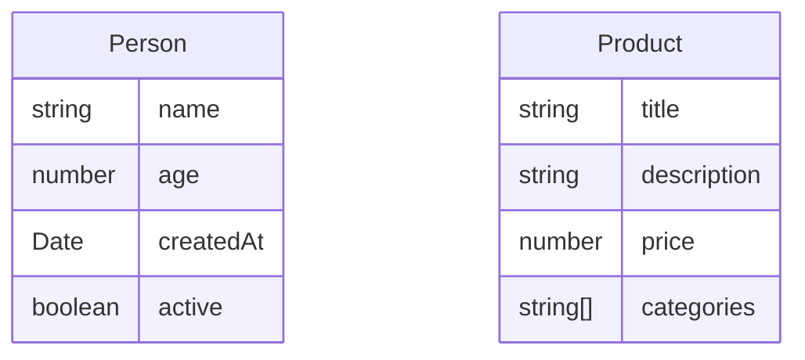
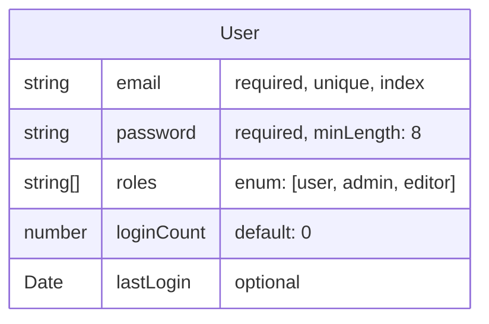
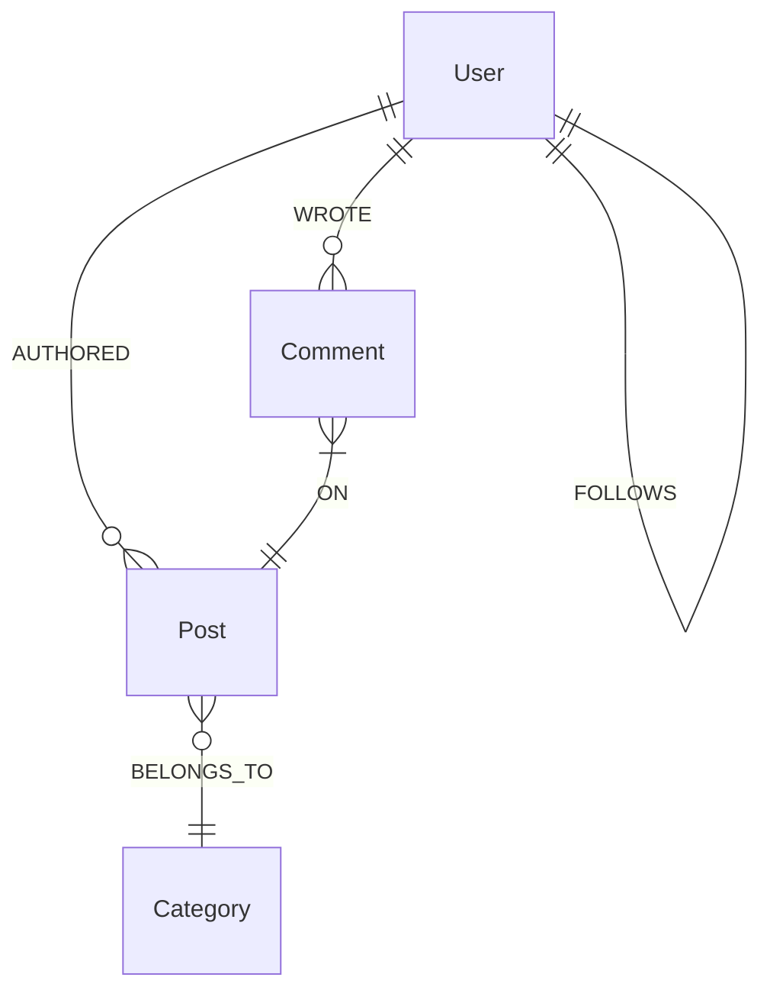
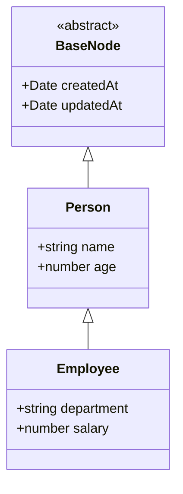
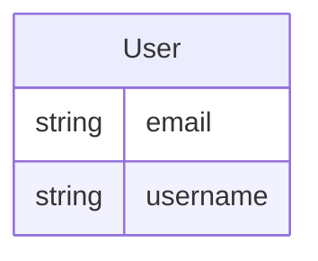
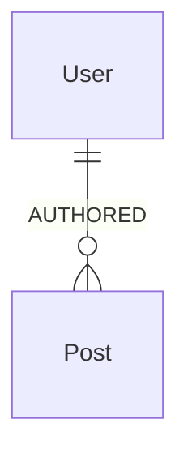

# Mermaid Schema Specification for NeoGM

This document outlines how we can use Mermaid diagrams to define Neo4j graph models for our NeoGM library.

## Overview

Mermaid offers several diagram types, but for our Neo4j OGM, we'll primarily leverage:

1. **Entity-Relationship Diagrams (ERD)**: For defining nodes, their properties, and relationships
2. **Class Diagrams**: For more complex scenarios with inheritance and advanced relationships

## Basic Entity Definition

### ER Diagram Syntax



### Mapping to Neo4j Model

This would generate models equivalent to:

```typescript
@Node('Person')
class Person {
    @Property({ type: String, required: true })
    name: string;
    
    @Property({ type: Number })
    age: number;
    
    @Property({ type: Date, default: () => new Date() })
    createdAt: Date;
    
    @Property({ type: Boolean, default: true })
    active: boolean;
}

@Node('Product')
class Product {
    @Property({ type: String, required: true })
    title: string;
    
    @Property({ type: String })
    description: string;
    
    @Property({ type: Number, required: true })
    price: number;
    
    @Property({ type: [String] })
    categories: string[];
}
```

## Property Attributes

We can extend the basic Mermaid ER syntax with comments to add validation and other attributes:



This translates to:

```typescript
@Node('User')
class User {
    @Property({ 
        type: String, 
        required: true, 
        unique: true, 
        index: true 
    })
    email: string;
    
    @Property({ 
        type: String, 
        required: true,
        validate: {
            validator: (v: string) => v.length >= 8,
            message: 'Password must be at least 8 characters'
        }
    })
    password: string;
    
    @Property({ 
        type: [String],
        enum: ['user', 'admin', 'editor']
    })
    roles: string[];
    
    @Property({ type: Number, default: 0 })
    loginCount: number;
    
    @Property({ type: Date })
    lastLogin: Date;
}
```

## Relationships

Mermaid ER diagrams provide relationship cardinality notation that maps well to Neo4j relationships:



This would generate:

```typescript
@Node('User')
class User {
    // ... properties
    
    @Relationship({ 
        type: 'AUTHORED', 
        direction: 'OUTGOING', 
        target: 'Post', 
        cardinality: 'ONE_TO_MANY' 
    })
    posts: Post[];
    
    @Relationship({ 
        type: 'FOLLOWS', 
        direction: 'OUTGOING', 
        target: 'User', 
        cardinality: 'ONE_TO_ONE' 
    })
    following: User;
    
    @Relationship({ 
        type: 'FOLLOWS', 
        direction: 'INCOMING', 
        target: 'User', 
        cardinality: 'ONE_TO_ONE' 
    })
    followers: User[];
    
    @Relationship({ 
        type: 'WROTE', 
        direction: 'OUTGOING', 
        target: 'Comment', 
        cardinality: 'ONE_TO_MANY' 
    })
    comments: Comment[];
}

@Node('Post')
class Post {
    // ... properties
    
    @Relationship({ 
        type: 'AUTHORED', 
        direction: 'INCOMING', 
        target: 'User', 
        cardinality: 'MANY_TO_ONE' 
    })
    author: User;
    
    @Relationship({ 
        type: 'BELONGS_TO', 
        direction: 'OUTGOING', 
        target: 'Category', 
        cardinality: 'MANY_TO_ONE' 
    })
    category: Category;
    
    @Relationship({ 
        type: 'ON', 
        direction: 'INCOMING', 
        target: 'Comment', 
        cardinality: 'ONE_TO_MANY' 
    })
    comments: Comment[];
}
```

## Relationship Properties

To add properties to relationships, we can use a custom syntax extension:

```mermaid
erDiagram
    User ||--o{ Product : PURCHASED {
        Date purchaseDate
        number quantity
        string paymentMethod
    }
```

Which would generate:

```typescript
@Node('User')
class User {
    // ... properties
    
    @Relationship({ 
        type: 'PURCHASED', 
        direction: 'OUTGOING', 
        target: 'Product',
        properties: {
            purchaseDate: { type: Date, default: () => new Date() },
            quantity: { type: Number, required: true },
            paymentMethod: { type: String }
        }
    })
    purchases: Array<{
        node: Product,
        properties: {
            purchaseDate: Date,
            quantity: number,
            paymentMethod: string
        }
    }>;
}
```

## Advanced Features

### Inheritance (Using Class Diagrams)



Would generate:

```typescript
abstract class BaseNode {
    @Property({ type: Date, default: () => new Date() })
    createdAt: Date;
    
    @Property({ type: Date, default: () => new Date() })
    updatedAt: Date;
}

@Node('Person')
class Person extends BaseNode {
    @Property({ type: String, required: true })
    name: string;
    
    @Property({ type: Number })
    age: number;
}

@Node('Employee')
class Employee extends Person {
    @Property({ type: String })
    department: string;
    
    @Property({ type: Number, required: true })
    salary: number;
}
```

### Indexes and Constraints

We can specify indexes and constraints in a dedicated section:



This would add constraints and indexes to our model:

```typescript
@Node('User')
@Indexes([
    { properties: ['email'] },
    { properties: ['username'], unique: true }
])
@Constraints([
    { properties: ['email', 'username'], type: 'unique' }
])
class User {
    @Property({ type: String, required: true })
    email: string;
    
    @Property({ type: String, required: true })
    username: string;
}
```

## Advanced Query Patterns

We can include common query patterns within the Mermaid definitions:



This would generate additional query methods:

```typescript
@Node('User')
class User {
    // ... properties and relationships
    
    // Generated query methods
    static async findWithPostsAfterDate(date: Date): Promise<Array<{user: User, post: Post}>> {
        return await query<{user: User, post: Post}>(`
            MATCH (u:User)-[:AUTHORED]->(p:Post) 
            WHERE p.createdAt > $date 
            RETURN u as user, p as post
        `, { date });
    }
    
    async countPosts(): Promise<number> {
        const result = await query<{postCount: number}>(`
            MATCH (u:User {id: $userId})-[:AUTHORED]->(p:Post) 
            RETURN count(p) as postCount
        `, { userId: this.id });
        return result[0].postCount;
    }
}
```

## CLI Usage

NeoGM would provide a command-line interface to generate TypeScript models from Mermaid diagrams:

```
$ neogm generate --from schema.mermaid --output models/
```

## Programmatic API

The library would also provide a programmatic API:

```typescript
import { generateModels } from 'neogm';

// Generate TypeScript model files
await generateModels('./schema.mermaid', './models');

// Or generate models in memory
const { User, Post, Comment } = await generateModelsInMemory(`
erDiagram
    User ||--o{ Post : AUTHORED
    User ||--o{ Comment : WROTE
    Comment }|--|| Post : ON
`);

// Use the generated models
const user = new User({ name: 'Alice' });
await user.save();
```

## Bidirectional Synchronization

A powerful feature would be the ability to:

1. Generate models from Mermaid diagrams
2. Extract Mermaid diagrams from existing code
3. Keep them synchronized

```typescript
// Generate Mermaid from models
const mermaidDiagram = await extractMermaidDiagram([User, Post, Comment]);
fs.writeFileSync('schema.mermaid', mermaidDiagram);

// Update models when diagram changes (watching mode)
await watchAndSyncModels('./schema.mermaid', './models');
```

## Integration with Documentation

Automatic generation of documentation that includes visualized model relationships:

```typescript
// Generate API documentation with Mermaid diagrams
await generateDocs('./models', './docs', {
    includeMermaid: true,
    theme: 'dark'
});
```

## Implementation Considerations

1. **Parser for Mermaid ER Diagrams**: We'll need to parse the Mermaid syntax
2. **Code Generation**: Transform parsed diagrams into TypeScript code
3. **Reverse Engineering**: Extract diagram from code
4. **Extensions**: Our custom extensions to Mermaid syntax for Neo4j-specific features

## Limitations and Challenges

1. Standard Mermaid doesn't fully support all graph features
2. We'll need to document our extensions clearly
3. Handling complex validation rules in a diagram syntax may be challenging
4. Ensuring type safety through diagram-generated code

## Conclusion

Using Mermaid diagrams as a schema definition for Neo4j OGM provides a unique visual approach to modeling graph databases. The visual nature of Mermaid aligns perfectly with the graph structure of Neo4j, making it an intuitive tool for developers to design and understand their data models.